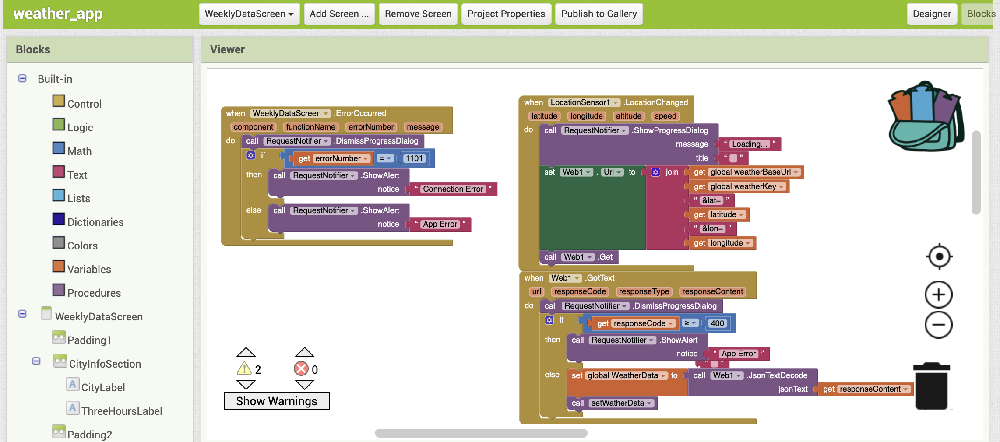
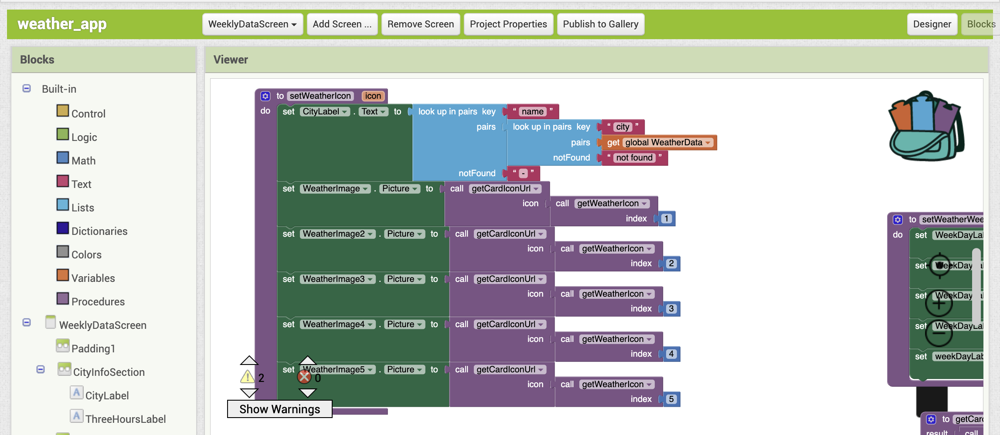
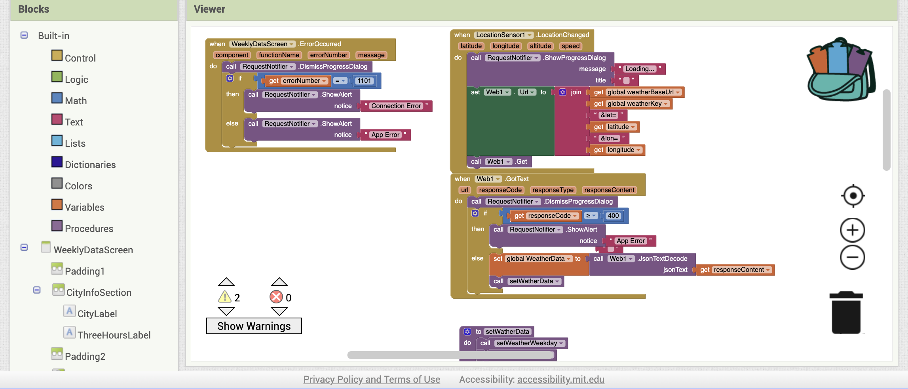

# TingYuChen-weather-app
<!--
*** Reference: https://github.com/othneildrew/Best-README-Template/tree/master
-->

<!-- PROJECT LOGO -->

   
  <h3 align="center">Weather App</h3>
  

    A weather MIT App
  

<!-- ABOUT THE PROJECT -->

## About The Project
- Redesign a new and simple website for an existing small local business: <a href="http://www.comoxvalleylifeline.com/">http://www.comoxvalleylifeline.com/</a>
- The page layouts are coded mobile-first and adjusted for desktop screens using media queries.

This is a fictional website that was designed and coded as an educational exercise. It is not intended to be seen outside of the class environment. None of the content and images were approved by the business owner.

(<a href="#readme-top">back to top</a>)

### Features of the app
  <ol>
    <li>
     Landing Screen
    </li>
    <li>
      Three Hours Weather
    </li>
    <li>Multiple Language support</li>
  </ol>

(<a href="#readme-top">back to top</a>)

### Main components using in the app
  <ol>
    <li>
     Storage/TingDB - Locally storage user's prefer language
    </li>
    <li>
      Connectivity/Web - Retrieve weather data through the Weather API.
    </li>
  </ol>

(<a href="#readme-top">back to top</a>)

### Landing Screen
- automatically detect location
- load current weather data base on current location
- multiple-language support 
  - English
  - Traditional Chinese
  [![Product Name Screen Shot][landing-screen.-screenshot]](https://example.com)

[![Product Name Screen Shot][mutiple-lanaguage-screen-screenshot]](https://example.com)

(<a href="#readme-top">back to top</a>)

### Three Hour Screen
- Displaying the weather temperature, time and weather icon for the next 15 hours with data every 3 hours
 
[![Product Name Screen Shot][three-hour-screen-screenshot]](https://example.com)

(<a href="#readme-top">back to top</a>)

### Code block Snapshots

  
  
  

(<a href="#readme-top">back to top</a>)

## Built With

   - 

- UI Reference 
  <a href="https://www.youtube.com/watch?v=48YwaTiYau0">https://www.youtube.com/watch?v=48YwaTiYau0</a>

## Summary details
### development process
The most challenging aspect while building the app is that, unlike web coding, using MIT App Inventor to handle data structures or sort data to fit the required data structure for MIT App can be quite tricky. We cannot print out logs to visualize the data structure, and the method to retrieve a JSON array is different from web development as well. Furthermore, when dealing with the UI, I need to use horizontal/vertical layout as alternative options to padding, requiring careful consideration for a readable layout.

### code review
Since data from the API needs to be sorted, after reviewing the code, it is advisable to use procedures to ensure that my blocks are not repeated

<!-- ACKNOWLEDGMENTS -->

## Acknowledgments

The resources I use for this project and would like to give credit to.

- [Weather App UI Design in Figma](https://www.youtube.com/watch?v=48YwaTiYau0)
- [MIT APP INVENTOR](https://appinventor.mit.edu/)

(<a href="#readme-top">back to top</a>)

<!-- MARKDOWN LINKS & IMAGES -->

[landing-screen.-screenshot]: assets/landing-screen.jpg
[mutiple-lanaguage-screen-screenshot]: assets/mutiple-lanaguage-screen.jpg
[three-hour-screen-screenshot]: assets/three-hour-weather-screen.jpg

